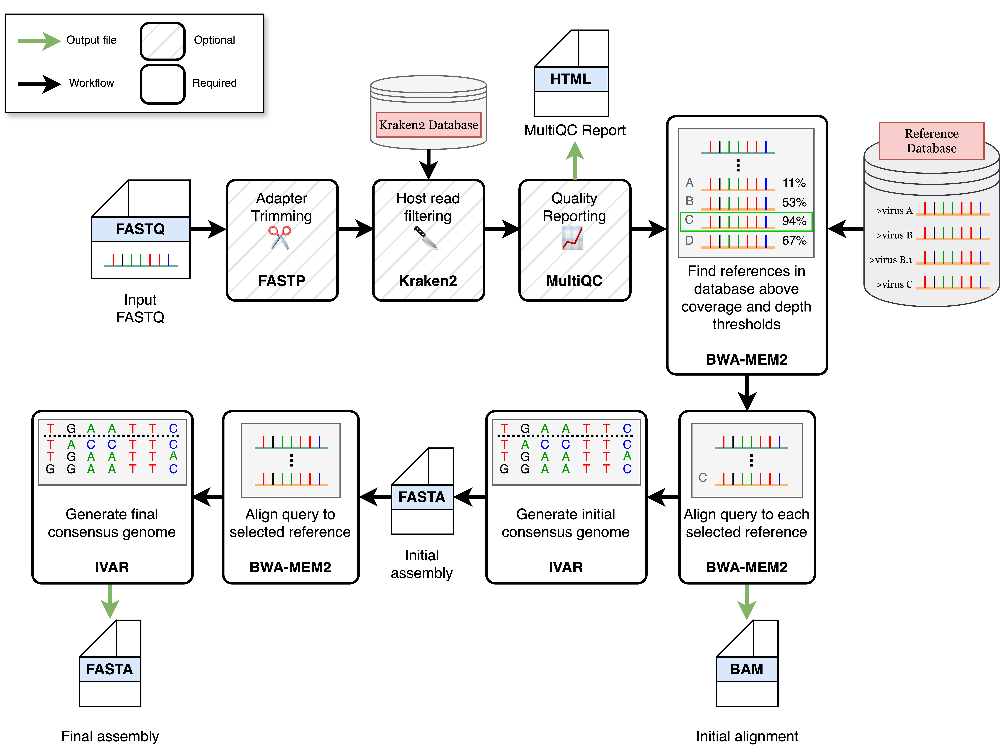

# revica-strm

strm = streamlined

This is a fork of the [original REVICA](https://github.com/greninger-lab/revica), meant for faster assembly of viral genomes from short-read sequencing data. It uses the BWA MEM aligner and employs additional assembly quality checks to provide higher-quality consensus genomes, while striving to make output files and reporting more concise and informative.

**Update 2025 July 16**: BWA MEM is now the default aligner used, due to [this issue](https://github.com/bwa-mem2/bwa-mem2/issues/262) with BWA MEM2. To use BWA MEM2, pass the `--use_mem2` option.

---

revica-strm is a reference-based viral consensus genome assembly pipeline for some of the most common respiratory viruses. revica-strm currently supports genome assembly of:
- Enterovirus (EV)
- Seasonal human coronavirus (HCOV)
- Human metapneumovirus (HMPV)
- Human respiratory syncytial virus (HRSV)
- Human parainfluenza virus (HPIV)
- Measles morbillivirus (MeV)
- Influenza A virus (FluA)
- Influenza B virus (FluB)
- Human adenovirus (HAdV)
- SARS-CoV-2

## How it works

revica-strm creates assembly genomes from raw FASTQ files in 2 fundamental steps:

1. **Create an initial, rough consensus sequence.** A given query sequence is aligned to all entries in a given database, with the best-mapping reference used to create an early consensus sequence with the general predicted features.

2. **Generate the final consensus for the query**. The query is realigned to the consensus from the previous step, and this alignment is used to generate the final assembly. This second pass serves to confirm unique features of the query that may have been suppressed during the previous assembly.
---
The important outputs are found in the output directory (specified by `--output`), in the `final_files` subdirectory:
- the final consensus sequence (filename contains `assembly.fa`)
- the BAM file(s) generated from the first alignment: this is useful for gauging how much of your RAW FASTQ data could be mapped to a known reference sequence. Located in the `align_to_selected_ref` directory.
- a MULTIQC report file named `<run name>_multiqc.html`

## Databases
This repository includes two example reference databases usable for assembly:

#### general respiratory viruses
- `assets/ref.fa`: a general purpose database containing sequences for the aforementioned supported viruses

#### influenza only
- `assets/flu.fasta`: the database used in the [Andersen Lab's avian influenza project](https://github.com/andersen-lab/avian-influenza). This database has been supplemented with recent influenza A H5, H1N1 and H3N1 strains, as well as Influenza B, across all available species collected from 2023-2024.

## Workflow


## Usage

`revica-strm <DIRECTORY WITH FASTQS> -profile docker [OPTIONS]`

Run `revica-strm -h` for option details.

## Installation

1. Install [Nextflow](https://www.nextflow.io/docs/latest/install.html) if you haven't already
2. Install [Docker](https://docs.docker.com/desktop/) if you haven't already
3. download the latest `revica-strm` run script and make it executable by running this command:

```bash
wget https://raw.githubusercontent.com/greninger-lab/revica-strm/refs/heads/main/revica-strm
chmod +x revica-strm
revica-strm
```

**For convenience, it's recommended to move `revica-strm` to somewhere in your `$PATH`, so you can run it from other directories**. Otherwise, you'll have to run it with something like `eval path/to/revica-strm`. For instructions on adding to `$PATH`, see [here](https://superuser.com/questions/488173/how-can-i-edit-the-path-on-linux).

## Instructions

1. Ensure the docker desktop client is updated and running

2. Arrange all input FASTQs (can be plain .fastq or compressed .fastq.gz) in their own directory.

##### 🚨 <span style="color: red;">MANDATORY: </span>all FASTQ files must have unique sample names before the first underscore ('_') character.

RIGHT: ```sample1_R1.fastq.gz sample1_R2.fastq.gz```  
WRONG: ```sample_1_R1.fastq.gz sample_2_R1.fastq.gz```  

- In the wrong case, sample_1_R1 would get wrongly paired with sample_2_R1.
- *It's recommended to have the read mate info (e.g. R1, 1) immediately follow the first underscore, after the unique sample name.*
- if sample names do not have underscores, this logic applies to the period ('.') character instead.

3. once you're sure your FASTQs are correctly named, run:

```
revica-strm <fastq_dir> -profile docker --output <out_dir>
```

You can test this command by downloading the example dataset included in this repository, `fastq_example`, and running:
```
revica-strm fastq_example -profile docker
```

For a description of all options, run `revica-strm -h`.

Once the pipeline is done, consensus genomes can be found in `$out_dir/final_files/final_assemblies/`. For reports of any genomes/samples that failed assembly QC thresholds, see files in `$out_dir/fail`.

## 🤓 For developers

### Running the pipeline with advanced nextflow options

The `revica-strm` script is just a wrapper over the basic `nextflow run` command; it creates a fastq samplesheet from given input directory, and passes other arguments to `nextflow run` itself. You can pass any of the typical `nextflow run` arguments to the `revica-strm` script. This includes the `-c` command to specify advanced options for, as an example, running the pipeline on AWS Batch or other cloud computing environments.

### Removing host (human) reads
Inputs to revica-strm can optionally be filtered with Kraken2 and a user-supplied Kraken2 database. This database should be comprised of host/contaminant genomes desired to be removed from downstream analysis.

To use this, run revica-strm with the `--run-kraken2` and `--kraken2_variants_host_filter` commands, and point the `--kraken2_db` argument to your kraken2 database.

>[!NOTE]
>To create a database we recommend for removal of human reads, see [these instructions](making_kraken2_human_db.md).

### Reference database
The reference database is comprised of multiple representatives of a variety of respiratory virus species such as enterovirus, seasonal coronavirus, SARS-CoV2, parainfluenza, measles, influenza, and more. Inspect `assets/ref.fa` if curious. If you intend to use your own database, ensure the fasta headers are structured as follows:   

```ACCESSION<SPACE>REF_TAG<SPACE>SAMPLE_HEADER```   

where REF_TAG should be unique to a species-specific segment/genome. Take these entries for Flu A segments PB1 and NS1, and an enterovirus genome, for example:

```
>NC_007364.1 fluA_NS1 Influenza A virus (A/goose/Guangdong/1/1996(H5N1)) segment 8, complete sequence
>NC_007375.1 fluA_PB1 Influenza A virus (A/Korea/426/1968(H2N2)) segment 2, complete sequence
>AF406813.1 EV Porcine enterovirus 8 strain V13, complete genome
```
You can specify your own reference database with `--db $REF_DB`.


## Contact
For bug reports, please raise an issue or contact me via the links in my [profile](https://github.com/epiliper/):
